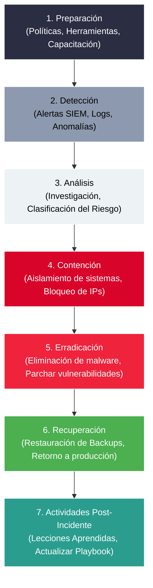

# Manuales de Estrategia (Playbooks) y Respuesta a Incidentes

Los **manuales de estrategia (playbooks)** son herramientas operativas indispensables que permiten a los profesionales de ciberseguridad identificar, contener y responder ante amenazas y vulnerabilidades de manera estandarizada y eficiente.

En esta lectura se profundiza en la estructura de los playbooks, sus tipos, su alineación con el plan de continuidad del negocio y el ciclo de vida de la respuesta a incidentes.

---

## ¿Qué es un Manual de Estrategia (Playbook)?

Un **playbook** es un manual técnico y de procedimiento que proporciona una lista predefinida, secuencial y actualizada de pasos de acción a seguir cuando se responde a un incidente de seguridad específico o se mitiga una vulnerabilidad.

### Estructura de un Playbook
Para que un playbook sea efectivo, debe estar respaldado por:
*   **Estrategia:** Define el alcance general, las expectativas y los roles y responsabilidades de cada miembro del equipo de seguridad.
*   **Plan de Acción:** El conjunto detallado de instrucciones técnicas y operativas sobre cómo completar las tareas específicas dentro del playbook.

> [!IMPORTANT]
> **Documentos Vivos:** Los playbooks no son estáticos. Deben actualizarse con frecuencia para reflejar la evolución del panorama de amenazas, los cambios legislativos o la detección de fallos y omisiones operativas tras auditorías de incidentes reales.

---

## Tipos de Playbooks de Seguridad

Las organizaciones desarrollan manuales enfocados en amenazas específicas según su superficie de ataque y sector:

*   **Vulnerabilidades e Incidentes Específicos:** Manuales de respuesta para ataques como Ransomware, Vishing (phishing por voz), Compromiso del Correo Electrónico Empresarial (BEC), Inyecciones SQL, etc.
*   **Condicionamiento Legal y Geográfico:** Las leyes de notificación y privacidad de datos de cada país moldean el contenido del playbook. Por ejemplo, el requerimiento de notificar a las autoridades de la UE en un máximo de 72 horas bajo GDPR en caso de brechas de datos determina la urgencia del paso de comunicación externa.

---

## Ciclo de Vida de la Respuesta a Incidentes en un Playbook

Basado en marcos estándar de ciberseguridad, un playbook de incidentes comúnmente sigue este flujo secuencial:

1.  **Preparación:** Garantizar que el personal esté entrenado y que las herramientas de monitoreo y mitigación estén configuradas adecuadamente.
2.  **Detección:** Descubrir indicios o alertas que sugieran la presencia de un comportamiento anómalo.
3.  **Análisis:** Validar la alerta para clasificar su gravedad y determinar el nivel de riesgo.
4.  **Contención:** Limitar la propagación del ataque aislando los hosts afectados, deshabilitando cuentas o configurando reglas temporales en el firewall.
5.  **Erradicación:** Remover por completo la causa raíz del incidente (por ejemplo, desinfectando malware o parchando el software vulnerable).
6.  **Recuperación:** Devolver de forma segura los sistemas a su estado operativo de producción (ej. restaurando desde copias de seguridad limpias).
7.  **Actividades Post-Incidente:** Reunir al equipo SOC para documentar las lecciones aprendidas y realizar mejoras al manual de estrategias.

---

## Relación con la Continuidad del Negocio y Análisis Forense

*   **Plan de Continuidad del Negocio (BCP):** Los playbooks se diseñan para alinearse con los objetivos de continuidad comercial de la organización, minimizando el tiempo de inactividad operativo tras una violación de seguridad.
*   **Determinación de Riesgo:** Para priorizar la respuesta, se evalúa el daño potencial utilizando la relación de riesgo clásica:
    $$\text{Riesgo} = \text{Probabilidad de la Amenaza} \times \text{Daño Potencial o Impacto}$$
*   **Urgencia y Cuidado Forense:** Un paso crítico en los playbooks defensivos es evitar el mal manejo de datos de logs o memoria volátil. Ejecutar comandos desordenados o reiniciar servidores sin recopilar evidencia puede comprometer los datos forenses, impidiendo una investigación posterior de responsabilidades legales o atribuciones de ataque.

---

## Recursos Globales de Referencia sobre Playbooks y Gestión de Incidentes

Para obtener plantillas o estructuras avanzadas de manuales de estrategia de otros marcos gubernamentales e internacionales, los analistas pueden consultar:

*   **Reino Unido (NCSC):** [Administración y Gestión de Incidentes de Ciberseguridad](https://www.ncsc.gov.uk/collection/incident-management).
*   **Australia (ACSC):** [Plan y Pautas de Respuesta ante Incidentes Cibernéticos](https://www.cyber.gov.au/resources-business-and-government/essential-cyber-security/incident-response).
*   **Japón (JPCERT/CC):** [Directrices y Gestión de Vulnerabilidades y Mitigaciones](https://www.jpcert.or.jp/english/).
*   **Canadá (CCCS):** [Manual de Estrategias y Recomendaciones contra Ransomware](https://www.cyber.gc.ca/en/guidance/ransomware-playbook-itsp40099).
*   **Gobierno de Escocia:** [Plantillas y Manuales de Estrategia para Respuesta ante Incidentes](https://www.gov.scot/publications/cyber-resilience-incident-response-playbook-template/).
