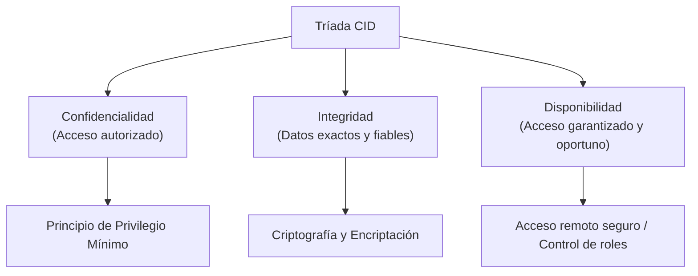

# Proteger a las organizaciones mediante la tríada CID

La tríada de **Confidencialidad, Integridad y Disponibilidad (CID)** es uno de los pilares fundamentales en ciberseguridad. Ayuda a las organizaciones a considerar, priorizar y mitigar los riesgos de manera estructurada. 

En esta lectura, se explora cómo los analistas de ciberseguridad aplican la tríada CID en sus tareas cotidianas en el entorno laboral.

---

## La tríada CID para analistas

La tríada CID es un modelo de referencia que guía la toma de decisiones al establecer sistemas, políticas y controles de seguridad. Mantener un nivel de riesgo aceptable en cada uno de estos tres pilares permite definir y sostener una **postura de seguridad** satisfactoria.

> [!NOTE]
> La **postura de seguridad** (security posture) se refiere a la capacidad general de una organización para gestionar la defensa de sus recursos y datos críticos, así como para reaccionar ante los cambios y amenazas del entorno.

---

## Componentes de la tríada

### 1. Confidencialidad
La **confidencialidad** garantiza que únicamente los usuarios, procesos o dispositivos autorizados puedan acceder a datos o recursos específicos.

En el entorno organizativo, la confidencialidad se implementa y refuerza a través de principios de diseño clave:
* **Principio de privilegio mínimo (Least Privilege):** Consiste en limitar el acceso de los usuarios exclusivamente a la información, herramientas y permisos estrictamente necesarios para realizar sus tareas laborales. Limitar el acceso innecesario disminuye significativamente la superficie de ataque y el riesgo de filtraciones de datos privados.

### 2. Integridad
La **integridad** asegura que los datos sean verificablemente correctos, auténticos, completos y confiables, impidiendo cualquier modificación o manipulación no autorizada.

Para garantizar la integridad, los analistas y administradores utilizan diferentes mecanismos:
* **Criptografía:** Consiste en transformar o codificar los datos para que no puedan ser leídos ni alterados por partes no autorizadas.
* **Encriptación (Cifrado):** El proceso de convertir datos legibles (texto plano) a un formato codificado (texto cifrado) ilegible sin la clave de descifrado correspondiente. Esto asegura que la comunicación interna (por ejemplo, chats corporativos o correos electrónicos) permanezca intacta y libre de manipulaciones externas o internas.

### 3. Disponibilidad
La **disponibilidad** garantiza que los datos, sistemas y recursos estén accesibles y operativos para los usuarios autorizados siempre que lo requieran.

En el contexto laboral diario, asegurar la disponibilidad implica balances técnicos y de seguridad:
* **Acceso remoto seguro:** Permitir que los empleados que trabajan a distancia accedan de manera segura a la red interna para realizar sus actividades.
* **Acceso basado en funciones:** Aunque los datos deben estar disponibles, el acceso sigue estando acotado por las necesidades del puesto. Por ejemplo, un empleado de contabilidad requiere acceso a los sistemas financieros de la empresa, pero no a los repositorios de código de desarrollo en curso.

---

## Puntos clave

* La tríada CID sirve como brújula estratégica para establecer y evaluar la postura de seguridad de una organización.
* Cada decisión técnica (desde elegir un método de cifrado hasta configurar permisos en una base de datos) impacta directamente en uno o más pilares de la tríada.
* Comprender cómo se aplican estos conceptos permite a los analistas de ciberseguridad diseñar mejores defensas para mitigar incidentes de seguridad y proteger los activos corporativos.
