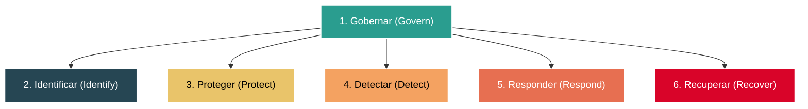
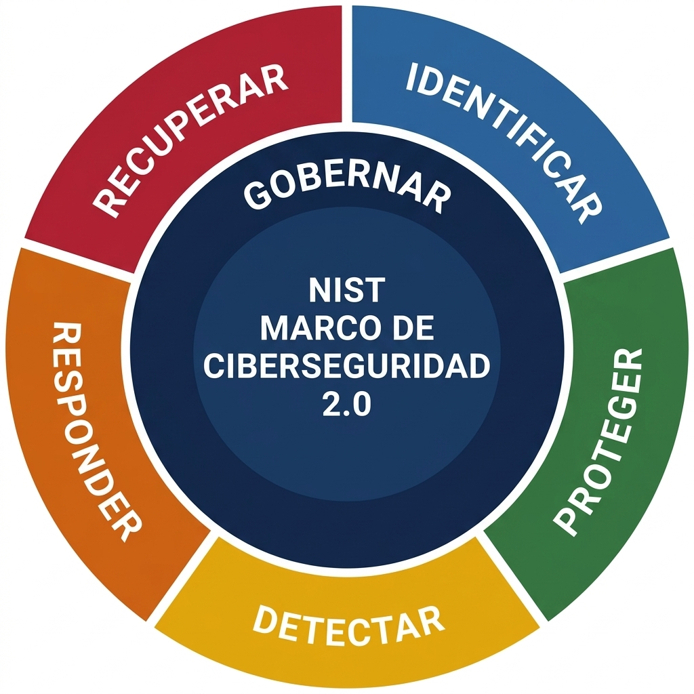

# El Marco de Ciberseguridad del NIST (NIST CSF v2.0)

El **Marco de Ciberseguridad del Instituto Nacional de Estándares y Tecnología (NIST CSF)** es una guía de referencia voluntaria compuesta por normas, directrices y mejores prácticas diseñadas para ayudar a las organizaciones a gestionar y reducir sus riesgos de ciberseguridad. 

Originalmente desarrollado para proteger infraestructuras críticas (como energía, salud y finanzas), su actualización más reciente, el **NIST CSF v2.0**, ha ampliado su alcance para ser aplicable y útil en cualquier tipo de organización, independientemente de su tamaño, sector o nivel de madurez técnica.

---

## Evolución clave: Del CSF v1.1 al CSF v2.0

La versión 2.0 introduce cambios significativos diseñados para adaptar el marco a las amenazas modernas y facilitar su implementación:

1. **Alcance Universal:** Ya no está enfocado exclusivamente en infraestructura crítica; se adaptó para PYMEs, grandes empresas, ONGs y administraciones gubernamentales.
2. **Nueva Función "Gobernar" (Govern):** Se añade como el núcleo estratégico del marco para conectar las decisiones técnicas con los objetivos comerciales y de alta dirección.
3. **Mayor Énfasis en la Cadena de Suministro (C-SCRM):** Introduce directrices robustas para gestionar los riesgos asociados a los proveedores tecnológicos y de servicios.
4. **Guías de Inicio Rápido (Quick-Start Guides):** NIST proporciona ahora plantillas y perfiles preconfigurados para acelerar su adopción.

---

## Las 6 Funciones Básicas del NIST CSF v2.0

En la versión v2.0, el marco se organiza en torno a **seis funciones concurrentes y continuas**. Estas funciones representan el ciclo de vida completo de la gestión de riesgos de ciberseguridad:

### 1. Gobernar (Govern - GV) 🏛️
Ubicada en el centro del marco, se encarga de definir, supervisar y monitorear la estrategia de gestión de riesgos, las políticas y las expectativas de ciberseguridad de la organización. 

Establece las directrices que rigen a las otras cinco funciones.
* **Actividades clave:**
  * Definición de políticas y estándares internos de ciberseguridad.
  * Determinación de los objetivos de seguridad alineados con el negocio.
  * Involucrar activamente a la dirección y definir responsabilidades claras.
  * Evaluación continua de la postura de seguridad y el cumplimiento legal.

### 2. Identificar (Identify - ID) 🔍
Esta función se relaciona con la gestión del riesgo de ciberseguridad y su impacto en el personal y los activos de una organización. Consiste en comprender el entorno organizacional para identificar activos (físicos y digitales), sistemas, datos, vulnerabilidades y dependencias de la cadena de suministro.
* **Perspectiva del Analista:** Un analista de seguridad podría monitorear sistemas para identificar posibles problemas de seguridad.
* **Actividades clave:**
  * Inventariar hardware, software y datos sensibles.
  * Identificar dependencias críticas y proveedores externos.
  * Evaluar vulnerabilidades internas y amenazas externas potenciales.

### 3. Proteger (Protect - PR) 🛡️
Se refiere a las estrategias para proteger a una organización mediante la implementación de políticas, procedimientos, capacitación y herramientas que mitigan las amenazas de ciberseguridad. Implica diseñar e implementar salvaguardas y contramedidas adecuadas para limitar o contener el impacto de un posible evento de ciberseguridad.
* **Perspectiva del Analista:** Esto incluye estudiar datos históricos y mejorar las políticas de seguridad.
* **Actividades clave:**
  * Implementar controles de acceso e identidades (como MFA y Privilegio Mínimo).
  * Aplicar cifrado de datos (en tránsito y en reposo).
  * Realizar concientización y capacitaciones periódicas de seguridad al personal.
  * Robustecer y parchear la infraestructura de red y sistemas.

### 4. Detectar (Detect - DE) 🚨
Implica identificar posibles incidentes de seguridad y mejorar las capacidades de monitoreo para aumentar la velocidad y eficiencia de las detecciones. Define las actividades necesarias para identificar de manera oportuna la ocurrencia de un incidente de ciberseguridad o comportamiento anómalo dentro de la red.
* **Perspectiva del Analista:** Un analista podría revisar la configuración de una herramienta de seguridad para asegurar que clasifique los riesgos y alerte al equipo.
* **Actividades clave:**
  * Configurar e instrumentar herramientas de monitoreo continuo (SIEM, IDS/IPS).
  * Analizar logs de sistema y auditorías en tiempo real.
  * Identificar y clasificar de inmediato las alertas de posibles amenazas.

### 5. Responder (Respond - RS) 📞
Asegura que se utilicen los procedimientos adecuados para contener, neutralizar y analizar incidentes de seguridad, e implementar mejoras en el proceso de seguridad. Abarca las acciones y playbooks que se ejecutan una vez que un incidente de seguridad es detectado.
* **Perspectiva del Analista:** Un analista podría trabajar en la recopilación de datos para documentar un incidente y sugerir mejoras.
* **Actividades clave:**
  * Gestión de incidentes e investigación técnica (análisis forense rápido).
  * Aislamiento y contención de sistemas comprometidos.
  * Comunicación interna y externa (notificación a reguladores, clientes o socios).

### 6. Recuperar (Recover - RC) 🔄
Es el proceso de devolver los sistemas afectados a su funcionamiento normal, promoviendo la resiliencia institucional.
* **Perspectiva del Analista:** Un analista de seguridad de nivel básico podría colaborar en la restauración de sistemas, datos y activos afectados por un incidente, como una brecha de seguridad.
* **Actividades clave:**
  * Restauración de copias de seguridad (backups) verificadas.
  * Ejecutar planes de continuidad del negocio y recuperación ante desastres (DRP).
  * Incorporar lecciones aprendidas para mejorar las defensas futuras.

---

## Visualización Conceptual del NIST CSF v2.0

A continuación se muestra el diagrama circular (rueda) correspondiente al NIST CSF v2.0 traducido al español, el cual sitúa a la función de **Gobernar** en el núcleo de la estrategia, rodeada por las otras 5 funciones operativas:

---

## Gestión de Riesgos en la Cadena de Suministro (C-SCRM) 🌐

Un cambio crítico del NIST CSF v2.0 es la elevación del **C-SCRM (Cybersecurity Supply Chain Risk Management)**. Se enfoca en mitigar los riesgos derivados de la adquisición y uso de productos y servicios tecnológicos provistos por terceros.

El marco integra esta gestión mediante la categoría **Gobernanza de la Cadena de Suministro (GV.SC)**, la cual establece:
1. **Identificación y Priorización:** Evaluar y clasificar a los proveedores en función de la criticidad de los datos y servicios a los que tienen acceso.
2. **Requisitos de Seguridad Claros:** Establecer cláusulas de ciberseguridad en contratos y acuerdos de nivel de servicio (SLA).
3. **Monitoreo Continuo:** Evaluar periódicamente que los proveedores cumplan con las salvaguardas exigidas, especialmente ante amenazas como componentes de hardware falsificados, software de terceros con puertas traseras o fallas en el desarrollo del proveedor (NIST SP 800-161).

---

## Resumen para el Analista de Ciberseguridad

Para un analista, el NIST CSF v2.0 no es una simple lista de verificación estática, sino un ciclo de mejora continua:
* **Gobernar, Identificar y Proteger** forman la base de la prevención.
* **Gobernar, Detectar, Responder y Recuperar** estructuran la gestión de incidentes reactivos y la resiliencia operativa.
