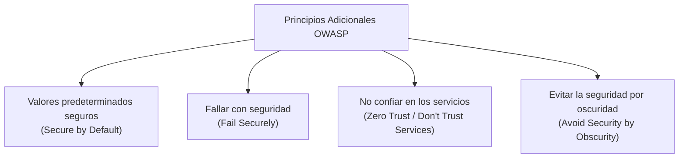

# Principios de Seguridad de OWASP

Los analistas de ciberseguridad protegen los datos y mitigan los riesgos organizacionales aplicando marcos de trabajo, controles y principios de seguridad. 

El **Proyecto Abierto de Seguridad en Aplicaciones Web** (recientemente renombrado como **Open Worldwide Application Security Project®** u **OWASP**) es una fundación sin fines de lucro de alcance global que ayuda a mejorar la seguridad del software. En esta lectura, se profundiza en los principios de seguridad clave definidos por OWASP y en cómo los analistas de nivel básico los aplican en su entorno laboral.

---

## Aplicación de Principios de Seguridad en el Lugar de Trabajo

Los principios de seguridad de OWASP no son conceptos teóricos aislados; están integrados en las tareas diarias de un analista. Se utilizan de forma práctica al:
* **Analizar registros (logs):** Para detectar patrones anormales y prevenir incidentes.
* **Supervisar sistemas SIEM:** Configurando y monitoreando paneles de información y eventos de seguridad para identificar accesos no autorizados.
* **Utilizar escáneres de vulnerabilidades:** Para auditar sistemas en busca de fallas antes de que un atacante las explote.

---

## Principios Básicos de Seguridad

OWASP promueve varios principios fundamentales para el diseño y operación de sistemas seguros:

1. **Minimizar la superficie de ataque:** La superficie de ataque es la suma de todos los puntos de entrada y vulnerabilidades potenciales que un agente de amenaza podría explotar. Minimizarla implica deshabilitar funciones, servicios y puertos innecesarios.
2. **Principio de privilegio mínimo (Least Privilege):** Limitar el acceso de los usuarios y procesos exclusivamente a los recursos mínimos necesarios para realizar sus funciones específicas.
3. **Defensa en profundidad:** Diseñar capas de seguridad redundantes. Si un control falla (por ejemplo, el firewall), otros controles (como la encriptación de datos o el control de identidades) deben estar activos para mitigar la amenaza.
4. **Separación de funciones (Segregación de tareas):** Repartir las acciones de alta criticidad entre diferentes personas o procesos. Ningún usuario debe poseer el control total de una transacción de extremo a extremo sin supervisión.
5. **Seguridad sencilla:** Evitar soluciones de seguridad innecesariamente complejas. La complejidad es enemiga de la seguridad porque dificulta la detección de errores de configuración y brechas.
6. **Solucionar correctamente los problemas de seguridad:** Ante un incidente, se debe realizar un análisis exhaustivo: identificar la causa raíz, contener el impacto, parchar la vulnerabilidad original y realizar pruebas de regresión para garantizar que la solución es definitiva y no introdujo fallas secundarias.

---

## Principios de Seguridad Adicionales de OWASP

A continuación se detallan cuatro principios esenciales que robustecen la resiliencia operativa:

### 1. Establecer valores predeterminados seguros (Secure by Default)
El estado de configuración por defecto de una aplicación o sistema debe ser el más seguro. El usuario no debería tener que realizar configuraciones adicionales para estar protegido; por el contrario, debería requerir un esfuerzo consciente y justificado si desea deshabilitar o relajar una medida de seguridad.
* *Ejemplo:* Una base de datos que al instalarse de fábrica deshabilita el acceso externo por red y exige cambiar la contraseña por defecto en el primer inicio.

### 2. Fallar con seguridad (Fail Securely)
Cuando un control de seguridad falla, se detiene o se corrompe, el sistema debe transicionar automáticamente al estado más restrictivo y seguro disponible en lugar de quedar expuesto.
* *Ejemplo:* Si un cortafuegos (firewall) experimenta una falla de hardware o caída del servicio, su comportamiento por defecto debe ser bloquear todas las conexiones entrantes y salientes (*Fail Close*) en lugar de abrirlas todas (*Fail Open*).

### 3. No confiar en los servicios (Don't Trust Services)
Las organizaciones interactúan de manera constante con sistemas, APIs y proveedores externos. Dado que no se controlan las políticas ni las prácticas de seguridad de estos terceros, la organización debe verificar y validar de forma estricta todos los datos y transacciones que provengan de ellos.
* *Ejemplo:* Si una aerolínea utiliza un proveedor externo para calcular los puntos de recompensa de los viajeros, la aerolínea debe sanitizar, validar sintácticamente e inspeccionar la consistencia de esos saldos en sus propios servidores antes de mostrar la información al cliente o permitir su canje.

### 4. Evitar la seguridad por oscuridad (Avoid Security by Obscurity)
La seguridad de un sistema no debe depender del secreto de su código fuente, arquitectura o mecanismos internos. Si ocultar el diseño es la única barrera de protección, el sistema es inherentemente inseguro. Un sistema bien diseñado debe ser seguro incluso si un atacante conoce su funcionamiento exacto.
* *Ejemplo:* De acuerdo con el estándar *OWASP Mobile Top 10*, proteger una app móvil no consiste en ocultar su código binario (que puede reversearse con facilidad), sino en implementar políticas robustas de contraseñas, defensa en profundidad, límites a transacciones críticas y controles estrictos de auditoría en el backend.

---

## Puntos clave

* Los principios de OWASP sirven como directrices operativas para programadores, analistas y arquitectos de seguridad.
* Entender cómo interactúan el principio de privilegio mínimo, fallar de forma segura y evitar la seguridad por oscuridad permite diseñar sistemas con resiliencia integrada.
* Mantenerse alineado con OWASP garantiza que la seguridad de las aplicaciones se adapte constantemente a las tácticas modernas de los atacantes globales.
