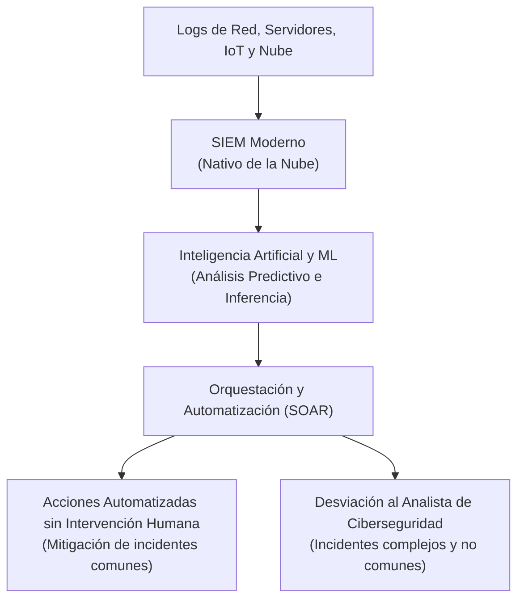

# Herramientas SIEM y el Futuro de la Gestión de Eventos de Seguridad

Las herramientas de **Administración de Información y Eventos de Seguridad (SIEM - Security Information and Event Management)** desempeñan un papel crítico en el monitoreo y visibilidad de los datos corporativos. Los analistas de ciberseguridad interactúan a diario con paneles SIEM para investigar alertas y mitigar riesgos.

En esta lectura se analiza el estado actual de las herramientas SIEM, su transición hacia entornos de nube y la evolución tecnológica impulsada por el IoT, la Inteligencia Artificial (IA) y la automatización mediante SOAR.

---

## Soluciones SIEM Actuales

Un **SIEM** es una herramienta o suite de software que recopila, centraliza y analiza datos de registros (logs) generados por dispositivos de red, servidores, firewalls y aplicaciones.

* **Monitoreo en tiempo real:** Rastrea eventos de seguridad en tiempo real.
* **Correlación de eventos:** Analiza patrones para detectar posibles incidentes complejos que involucran múltiples sistemas.
* **Interacción humana requerida:** Actualmente, la mayoría de los sistemas SIEM tradicionales dependen fuertemente de analistas de seguridad para interpretar las alertas, investigar falsos positivos y ejecutar acciones correctivas manuales.

---

## Evolución hacia la Nube (Cloud SIEM)

Con la migración masiva de la infraestructura corporativa a la nube, las soluciones SIEM se han adaptado para operar en entornos remotos:

### A. SIEM Alojado en la Nube (Cloud-Hosted SIEM)
* La aplicación y los datos son hospedados por el proveedor.
* El proveedor mantiene y gestiona la infraestructura de servidores necesaria.
* La organización accede a la herramienta a través de Internet. Es ideal para empresas que desean evitar costos de implementación y mantenimiento de hardware local.

### B. SIEM Nativo de la Nube (Cloud-Native SIEM)
* Diseñado desde cero para aprovechar al máximo las capacidades nativas de la computación en la nube (ej., arquitecturas serverless, microservicios).
* Ofrece **escalabilidad elástica** automática para procesar incrementos bruscos de volumen de logs.
* Proporciona alta disponibilidad y flexibilidad sin la necesidad de rediseñar o dimensionar la base de datos de almacenamiento.

---

## Desafíos Modernos y el Incremento de la Superficie de Areques

El ecosistema digital actual exige que el SIEM siga evolucionando rápidamente debido a:

* **El Internet de las Cosas (IoT):** La multiplicación de dispositivos inteligentes interconectados (cámaras, sensores, wearables) expande significativamente la **superficie de ataque** de las organizaciones.
* **Diversidad y Volumen de Datos:** El flujo continuo de logs heterogéneos generados por dispositivos IoT requiere una capacidad de procesamiento y almacenamiento masiva que supera a los SIEM tradicionales locales.

---

## El Futuro de las Herramientas SIEM: IA, ML y SOAR

La convergencia de nuevas tecnologías está redefiniendo cómo funcionan los centros de operaciones de seguridad (SOC):

### 1. Inteligencia Artificial (IA) y Aprendizaje Automático (ML)
La IA y el ML se integran en el SIEM para:
* Identificar comportamientos y terminología de amenazas emergentes.
* Detectar anomalías que escapan a las reglas estáticas tradicionales de correlación.
* Optimizar la visualización de paneles mostrando alertas agrupadas por severidad y probabilidad real de ataque, disminuyendo la fatiga por alertas.

### 2. Automatización mediante SOAR (Orquestación, Automatización y Respuesta de Seguridad)
**SOAR** es un conjunto de herramientas y flujos de trabajo (playbooks) que automatizan la respuesta a incidentes de seguridad sin requerir intervención humana directa.
* **Procesamiento ágil:** Ante una alerta común (ej. múltiples intentos de inicio de sesión fallidos desde un país extranjero), el SOAR puede bloquear la dirección IP sospechosa en el firewall de forma automática.
* **Optimización de recursos:** Al automatizar las tareas repetitivas y de bajo riesgo, los analistas de seguridad quedan libres para enfocar sus esfuerzos en la investigación y remediación de incidentes de seguridad complejos y atípicos que requieren el criterio humano.

---

## Herramientas de Ciberseguridad: Código Abierto (Open Source) vs. Propietarias

Los profesionales de la seguridad informática utilizan una combinación de herramientas tanto propietarias como de código abierto para monitorear, identificar y contener amenazas de forma eficaz.

### Comparativa General

| Característica | Herramientas de Código Abierto (Open Source) | Herramientas Propietarias (Licenciadas) |
| :--- | :--- | :--- |
| **Costo** | Generalmente gratuitas (sin licenciamiento base). | Requieren el pago de una licencia, cuota por uso o suscripción. |
| **Código Fuente** | Público. Cualquiera puede ver, modificar y mejorar el código. | Privado. Solo la persona o empresa propietaria tiene acceso. |
| **Soporte y Actualizaciones** | Mantenido de forma colaborativa por la comunidad global de desarrolladores. | Gestionado y distribuido exclusivamente por el fabricante del software. |
| **Personalización** | Altamente adaptable a las necesidades de la organización. | Limitada a las características y configuraciones provistas por el desarrollador. |
| **Ejemplos** | Linux, Suricata, Wireshark, Zeek. | Splunk® Enterprise, Google SecOps (Chronicle) SIEM. |

---

### Mitigación de Mitos sobre el Código Abierto

> [!NOTE]
> **El mito de la inseguridad:** Existe la idea errónea de que las herramientas de código abierto son menos seguras que las propietarias porque su código está expuesto al público. 
> 
> **La realidad técnica:** La amplia exposición y el acceso inmediato al código fuente por parte de miles de profesionales y analistas alrededor del mundo permite identificar y corregir errores, bugs y vulnerabilidades de manera mucho más rápida. Si bien los atacantes pueden buscar debilidades en el código abierto, la comunidad defensiva suele parchear los fallos inmediatamente después de ser descubiertos, convirtiendo a muchas de estas herramientas en estándares de la industria (como Linux y Suricata).

---

### Ejemplos Críticos de Herramientas

#### 1. Linux (Sistema Operativo de Código Abierto)
Es el sistema operativo fundamental para las tareas de ciberseguridad. Actúa como el intermediario directo entre el hardware de un equipo y el usuario/aplicaciones.
* **Flexibilidad:** Permite a los analistas interactuar directamente con el sistema a través de la Interfaz de Línea de Comandos (CLI) para automatizar tareas, auditar logs y ejecutar herramientas de seguridad dedicadas.
* **Distribuciones especializadas:** Existen sistemas construidos sobre el kernel de Linux diseñados específicamente para análisis forense, pruebas de penetración o monitoreo de redes.

#### 2. Suricata (Motor de Análisis de Red y Detección de Amenazas)
Desarrollado y mantenido por la **Open Information Security Foundation (OISF)**, Suricata es un motor de análisis de red gratuito y de código abierto de alto rendimiento.
* **Funciones principales:** Inspecciona el tráfico de red en busca de comportamientos anómalos o maliciosos, y genera alertas detalladas de red.
* **Integración SIEM:** Suricata se integra nativamente con la mayoría de las plataformas SIEM (tanto propietarias como libres) para enviar logs de red que luego son correlacionados por los analistas en paneles unificados.

---

## Paneles SIEM y su Aplicación Práctica: Splunk vs. Chronicle

Las herramientas SIEM centralizan la telemetría corporativa en tableros interactivos (dashboards). A continuación, se detallan los paneles principales de dos de las plataformas más utilizadas en la industria: **Splunk** (líder propietario híbrido) y **Google Chronicle** (solución nativa de la nube).

### A. Paneles Clave en Splunk® (Enterprise / Cloud)

Splunk ayuda a los equipos SOC a monitorear la infraestructura interna recopilando, buscando y analizando logs de múltiples fuentes en tiempo real.

| Nombre del Panel | Propósito Principal | Aplicación del Analista de Ciberseguridad |
| :--- | :--- | :--- |
| **Postura de Seguridad** *(Security Posture)* | Diseñado para el uso diario en el SOC. Muestra eventos notables y tendencias de las últimas 24 horas. | Investigar y rastrear incidentes y amenazas potenciales en tiempo real (ej. tráfico sospechoso originado desde una IP específica). |
| **Resumen Ejecutivo** *(Executive Summary)* | Muestra estadísticas históricas de alto nivel sobre la salud general de la ciberseguridad corporativa. | Presentar informes de métricas, volumen de incidentes resueltos y tendencias de riesgo a las partes interesadas (stakeholders). |
| **Revisión de Incidentes** *(Incident Review)* | Resalta los elementos de mayor riesgo que requieren atención inmediata y genera una cronología visual de eventos. | Identificar patrones de ataque complejos y reconstruir la línea de tiempo de una intrusión para su contención. |
| **Análisis de Riesgos** *(Risk Analysis)* | Muestra el nivel de riesgo por cada objeto (usuario, dispositivo, dirección IP) y detecta anomalías de comportamiento. | Analizar el impacto de vulnerabilidades en activos críticos y priorizar esfuerzos de mitigación basándose en el comportamiento del usuario. |

---

### B. Paneles Clave en Google Chronicle (Google SecOps)

Chronicle es un SIEM nativo de la nube que indexa y analiza logs de seguridad a escala masiva correlacionando la información en base a recursos, usuarios, dominios e IPs.

| Nombre del Panel | Propósito Principal | Aplicación del Analista de Ciberseguridad |
| :--- | :--- | :--- |
| **Estadísticas Empresariales** *(Enterprise Insights)* | Destaca alertas recientes e identifica nombres de dominio sospechosos en los registros (Indicadores de Compromiso - IOC). | Monitorear accesos o solicitudes inusuales a activos críticos desde dispositivos o ubicaciones no habituales, evaluando su gravedad. |
| **Salud e Ingestión de Datos** *(Data Ingestion & Health)* | Muestra el volumen de registros procesados, las fuentes activas de logs y las tasas de éxito de carga. | Asegurar que todas las fuentes de telemetría envíen datos sin errores, evitando puntos ciegos de visibilidad en el SOC. |
| **Coincidencia de IOC** *(IOC Matches)* | Registra tendencias a lo largo del tiempo cruzando alertas con dominios de internet y direcciones IP maliciosas conocidas. | Buscar actividad adicional relacionada con un indicador comprometido (ej., identificar si otros usuarios han accedido al mismo dominio dañino). |
| **Panel Principal** *(Main Dashboard)* | Proporciona un resumen ejecutivo de las alertas, actividades de ingestión de logs e incidentes a lo largo del tiempo. | Acceder rápidamente a picos inusuales de actividad (ej., ráfagas de inicios de sesión fallidos) para identificar nuevas tendencias de ataque. |
| **Detección de Reglas** *(Rules Detections)* | Muestra estadísticas de alertas activadas por reglas de detección programadas en la plataforma. | Monitorear alertas recurrentes asociadas a una regla específica (ej. detección de descargas de adjuntos de correo maliciosos conocidos). |
| **Inicio de Sesión de Usuario** *(User Login Overview)* | Rastrea el comportamiento de acceso de todos los usuarios en la organización corporativa. | Identificar comportamientos de autenticación anómalos o de riesgo (ej., inicios de sesión concurrentes desde ubicaciones geográficas imposibles). |

---

## Puntos Clave para el Analista de Ciberseguridad

* Monitorear y responder a alertas en paneles SIEM será una de tus actividades principales como analista junior, haciendo uso de herramientas propietarias avanzadas como **Splunk** y **Chronicle** junto a sistemas de código abierto como **Linux** y **Suricata**.
* Entender el propósito específico de cada panel (postura de seguridad, revisión de incidentes, ingestión de datos e inicio de sesión) te permitirá navegar con mayor agilidad, priorizando incidentes reales frente a falsos positivos.
* Mantenerse actualizado sobre tendencias como la automatización (**SOAR**), la computación en la nube y el uso de **herramientas tanto libres como licenciadas** en el SOC te proporcionará las bases para adaptarte a los cambios continuos del sector.
