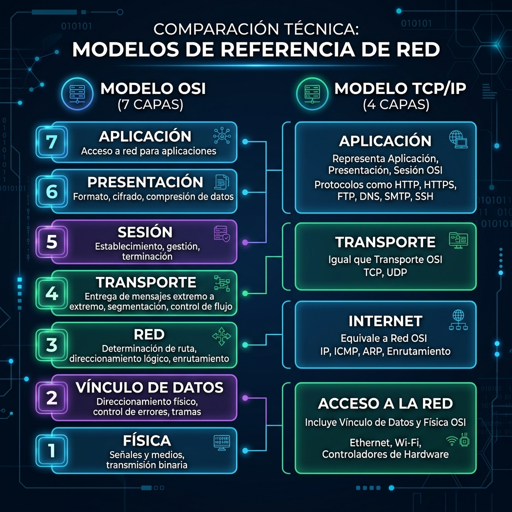

# El Modelo TCP/IP y el Modelo OSI

En esta lectura, profundizará en el modelo **Protocolo de control de transmisión/Protocolo de Internet (TCP/IP)**, analizará las diferencias con el **Modelo de interconexión de sistemas abiertos (OSI)** y aprenderá cómo están relacionados. A continuación, se detalla cada capa del Modelo TCP/IP y los protocolos más comunes utilizados en cada una.

Como profesional de la seguridad, es fundamental comprender el Modelo TCP/IP porque describe la función de los diversos protocolos de red. El Modelo TCP/IP se basa en la suite de protocolos TCP/IP, que incluye todos los protocolos que soportan la comunicación de red.

> **Definición:** Un **protocolo de red** (o protocolo de Internet) es un conjunto de normas utilizadas para enrutar y direccionar paquetes de datos cuando viajan entre dispositivos de una red.

Tanto el modelo TCP/IP como el OSI sirven como pautas representativas de cómo se comunican los hosts a través de una red.

---

## El Modelo TCP/IP

El **Modelo TCP/IP** es un *framework* utilizado para visualizar cómo se organizan y transmiten los datos a través de una red. Ayuda a los ingenieros y analistas de seguridad de red a conceptualizar los procesos y comunicar dónde ocurren las interrupciones o las amenazas de seguridad.

Al solucionar problemas, los profesionales de seguridad pueden determinar qué capas fueron afectadas por un ataque según los procesos e implicaciones del incidente.

El Modelo TCP/IP consta de **cuatro capas**:

1. **Capa de aplicación**
2. **Capa de transporte**
3. **Capa de Internet**
4. **Capa de acceso a la red**

---

## Capas del Modelo TCP/IP y sus Protocolos

### 1. Capa de acceso a la red *(Network Access Layer)*

A veces denominada capa de vínculo de datos o capa física/enlace, se ocupa de la creación de paquetes de datos y su transmisión a través de la red física.

- **Hardware asociado:** Concentradores (hubs), módems, cables y cableado físico.
- **Protocolo clave:**
  - **ARP (Address Resolution Protocol):** Dado que las direcciones MAC identifican a los hosts en la misma red física, ARP asigna direcciones IP a direcciones MAC para permitir la comunicación local.

### 2. Capa de Internet *(Internet Layer)*

A veces denominada capa de red, es responsable de garantizar la entrega de paquetes al host de destino, incluso si reside en una red diferente. Asigna direcciones IP (origen y destino) y determina qué protocolo entregará los paquetes.

- **Protocolos clave:**
  - **IP (Internet Protocol):** Envía paquetes de datos al destino correcto. Se apoya en TCP o UDP para entregarlos al servicio correspondiente. Permite la comunicación entre distintas redes.
  - **ICMP (Internet Control Message Protocol):** Comparte información sobre errores y estado de los paquetes. Es vital para detectar y solucionar problemas de red (paquetes perdidos, fallos de conectividad, redirecciones).

### 3. Capa de transporte *(Transport Layer)*

Es responsable de la entrega de datos entre dos sistemas o redes e incluye controles sobre el flujo de tráfico.

- **Protocolos clave:**
  - **TCP (Transmission Control Protocol):** Protocolo orientado a la conexión que permite a dos dispositivos establecer un enlace y transmitir datos de forma fiable. Utiliza números de puerto de servicio especificados en el encabezado TCP y retransmite datos perdidos o corruptos.
  - **UDP (User Datagram Protocol):** Protocolo **no** orientado a la conexión. No realiza seguimiento exhaustivo ni verifica el estado de entrega. Se utiliza en aplicaciones sensibles al rendimiento en tiempo real (ej. transmisión de video o streaming).

### 4. Capa de aplicación *(Application Layer)*

Equivale a la combinación de las capas de Aplicación, Presentación y Sesión del modelo OSI. Define a qué servicios y aplicaciones puede acceder el usuario y determina cómo interactúan los datos con las aplicaciones receptoras.

- **Protocolos clave:**
  - **HTTP** *(Hypertext Transfer Protocol)*
  - **SMTP** *(Simple Mail Transfer Protocol)*
  - **SSH** *(Secure Shell)*
  - **FTP** *(File Transfer Protocol)*
  - **DNS** *(Domain Name System)*

---

## Modelo TCP/IP frente al Modelo OSI

El modelo OSI organiza visualmente los protocolos de red en **7 capas**, mientras que el modelo TCP/IP es una versión más simplificada y práctica de **4 capas**.

### Tabla de Correspondencia

| Modelo OSI (7 Capas)                                                   | Modelo TCP/IP (4 Capas)              | Protocolos Comunes                                     |
| :--------------------------------------------------------------------- | :----------------------------------- | :----------------------------------------------------- |
| **7. Aplicación****6. Presentación****5. Sesión** | **4. Capa de Aplicación**     | HTTP, HTTPS, SSH, FTP, SMTP, DNS, DHCP                 |
| **4. Transporte**                                                | **3. Capa de Transporte**      | TCP, UDP                                               |
| **3. Red**                                                       | **2. Capa de Internet**        | IP (IPv4/IPv6), ICMP, IPsec                            |
| **2. Enlace de Datos****1. Física**                       | **1. Capa de Acceso a la Red** | Ethernet, Wi-Fi (802.11), ARP, Hardware (Hubs, cables) |

---

## Puntos Clave

- **Visualización:** Ambos modelos son marcos conceptuales para estructurar y comprender la transmisión de datos y el funcionamiento de los protocolos.
- **Número de capas:** TCP/IP tiene **4 capas**, mientras que OSI tiene **7 capas**.
- **Enfoque de ciberseguridad:** Los analistas de seguridad utilizan estos modelos para diagnosticar en qué punto de la pila de red ocurre un ataque, fallo o vulnerabilidad.
