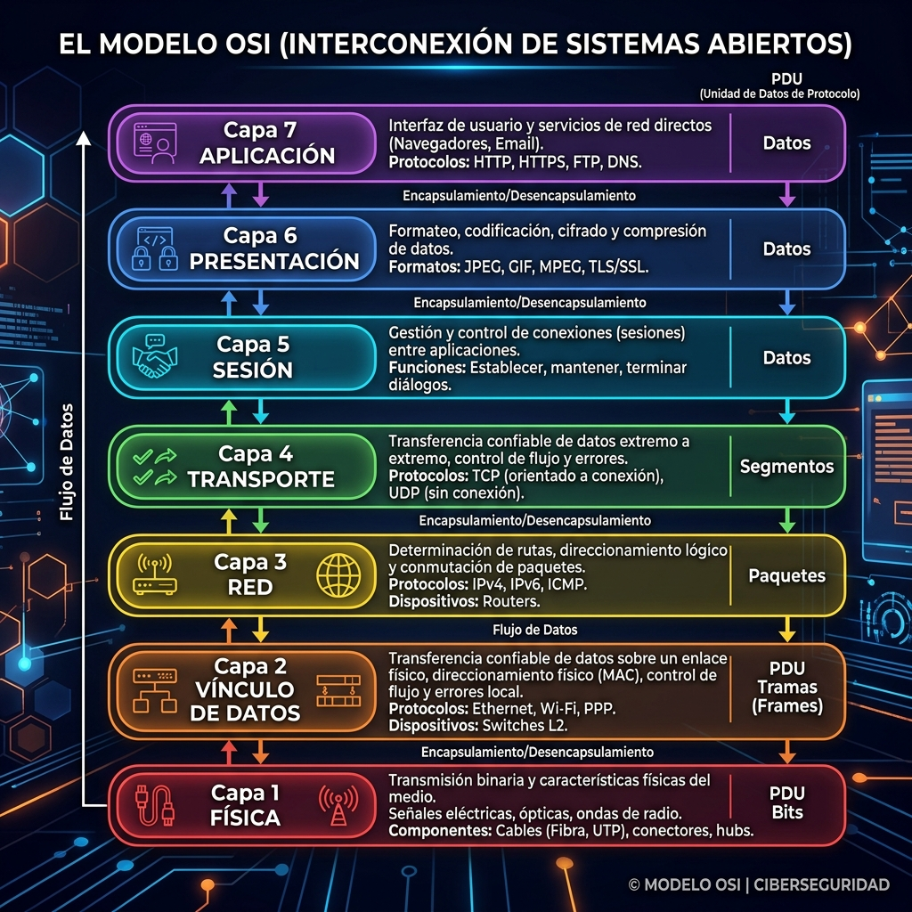
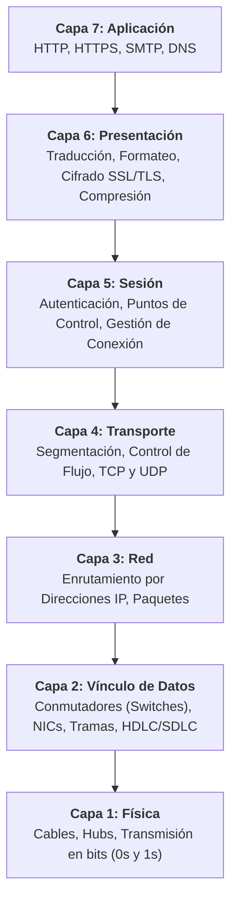

# El Modelo OSI (Interconexión de Sistemas Abiertos)

En esta lectura, profundizará en el **Modelo OSI (Open Systems Interconnection)**, un marco conceptual estandarizado de **7 capas** que detalla cómo los ordenadores se comunican y envían datos a través de una red.

Mientras que el Modelo TCP/IP de 4 capas ofrece una versión condensada y práctica, el Modelo OSI proporciona una comprensión más detallada y profunda de los procesos que ocurren en cada etapa de la comunicación.

---

## Comparativa: Modelo TCP/IP frente al Modelo OSI

Ambos modelos ayudan a los ingenieros de redes y analistas de seguridad a visualizar los procesos de red y determinar la ubicación exacta de fallos, interrupciones o amenazas de seguridad.

- **Modelo TCP/IP (4 capas):** Concentrado en el conjunto de protocolos clave de Internet.
- **Modelo OSI (7 capas):** Marco de referencia estandarizado universalmente utilizado para la enseñanza y el diagnóstico detallado.

> **Importante para el Analista de Seguridad:** Algunas organizaciones se estructuran en torno a TCP/IP mientras que otras prefieren OSI. Dominar ambos modelos es indispensable para analizar incidentes y comunicarse eficazmente con otros equipos de TI.

---

## Estructura de las 7 Capas del Modelo OSI

A continuación, se recorre el modelo **de arriba hacia abajo (Capa 7 a Capa 1)**, desde la interacción directa con el usuario hasta la transmisión física de bits.

---

## Desglose Detallado de las Capas

### Capa 7: Capa de aplicación *(Application Layer)*
Es la capa de interacción directa con el usuario final y las aplicaciones de software.
- **Función principal:** Proporciona los protocolos de red que permiten a las aplicaciones conectar al usuario con Internet.
- **Ejemplos:**
  - **Navegadores web:** Utilizan **HTTP/HTTPS** para intercambiar información con servidores web.
  - **Clientes de correo:** Utilizan **SMTP** para enviar y recibir correos electrónicos.
  - **DNS:** Traduce nombres de dominio legibles (ej. `google.com`) en direcciones IP.

### Capa 6: Capa de presentación *(Presentation Layer)*
Se encarga de preparar y formatear los datos para que puedan ser interpretados por la capa de aplicación o por el sistema receptor.
- **Funciones principales:** Traducción de formatos, compresión de datos y cifrado/descifrado de seguridad.
- **Ejemplo:** **SSL/TLS**, que cifra los datos intercambiados entre un navegador y un servidor web (sitios HTTPS).

### Capa 5: Capa de sesión *(Session Layer)*
Gestiona el inicio, mantenimiento y finalización de las conexiones (sesiones) entre dos dispositivos.
- **Funciones principales:** Autenticación, reconexión y establecimiento de **puntos de control** durante la transferencia de datos.
- **Utilidad:** Si la conexión se interrumpe, los puntos de control permiten reanudar la transmisión desde el último punto registrado en lugar de iniciar desde cero.

### Capa 4: Capa de transporte *(Transport Layer)*
Es responsable de la entrega eficiente y confiable de datos entre dispositivos.
- **Funciones principales:** Control del flujo de datos, regulación de la velocidad de transferencia y **segmentación** (división de transmisiones grandes en trozos pequeños para su posterior reensamblaje).
- **Protocolos clave:** **TCP** (orientado a conexión, confiable) y **UDP** (sin conexión, rápido).

### Capa 3: Capa de red *(Network Layer)*
Supervisa la entrega de paquetes entre diferentes redes a través del enrutamiento.
- **Funciones principales:** Asignación de direcciones IP (origen y destino) y selección de la mejor ruta a través de routers.
- **Elemento clave:** **Paquetes de datos** y direccionamiento IP.

### Capa 2: Capa de vínculo de datos *(Data Link Layer)*
Organiza y gestiona la transferencia de datos dentro de una misma red local (LAN).
- **Dispositivos clave:** Conmutadores *(Switches)* y tarjetas de interfaz de red *(NICs)*.
- **Protocolos comunes:** NCP, HDLC, SDLC y resolución de direcciones MAC.

### Capa 1: Capa física *(Physical Layer)*
Corresponde al hardware y medios físicos involucrados en la transmisión de datos.
- **Componentes:** Cables Ethernet, fibra óptica, concentradores *(Hubs)* y módems.
- **Función:** Convierte los paquetes de datos en un flujo de **bits (0s y 1s)** enviados a través del medio físico.

---

## Tabla Resumen del Modelo OSI

| Capa | Nombre | Unidad de Datos | Dispositivos / Protocolos Principales |
| :---: | :--- | :--- | :--- |
| **7** | **Aplicación** | Datos | HTTP, HTTPS, SMTP, DNS, FTP, SSH |
| **6** | **Presentación** | Datos | SSL/TLS, JPEG, ASCII, Cifrado/Compresión |
| **5** | **Sesión** | Datos | NetBIOS, RPC, Puntos de control de sesión |
| **4** | **Transporte** | Segmentos | TCP, UDP |
| **3** | **Red** | Paquetes | IP (IPv4/IPv6), ICMP, Routers |
| **2** | **Vínculo de Datos** | Tramas | Switches, NICs, ARP, Ethernet, HDLC |
| **1** | **Física** | Bits (0s/1s) | Cables, Hubs, Módems, Señales físicas |

---

## Claves del Tema

- **Propósito conceptual:** Tanto TCP/IP como OSI ayudan a diseñar, diagnosticar y documentar procesos de red.
- **7 Capas:** El modelo OSI desglosa con mayor detalle el proceso de comunicación en comparación con las 4 capas de TCP/IP.
- **Uso en Ciberseguridad:** Los profesionales utilizan el modelo OSI para aislar componentes vulnerables, identificar el vector de ataque y aplicar mitigaciones específicas en la capa afectada.
