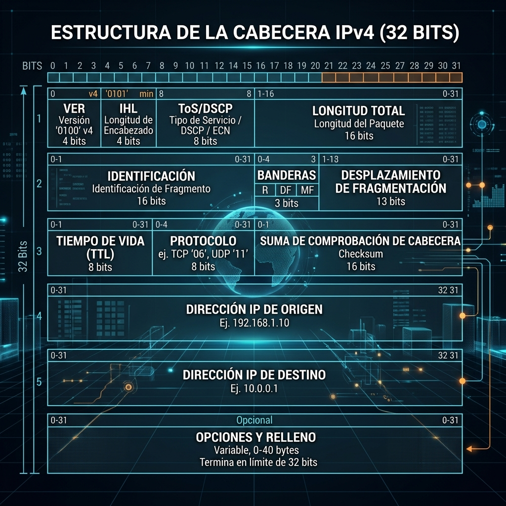
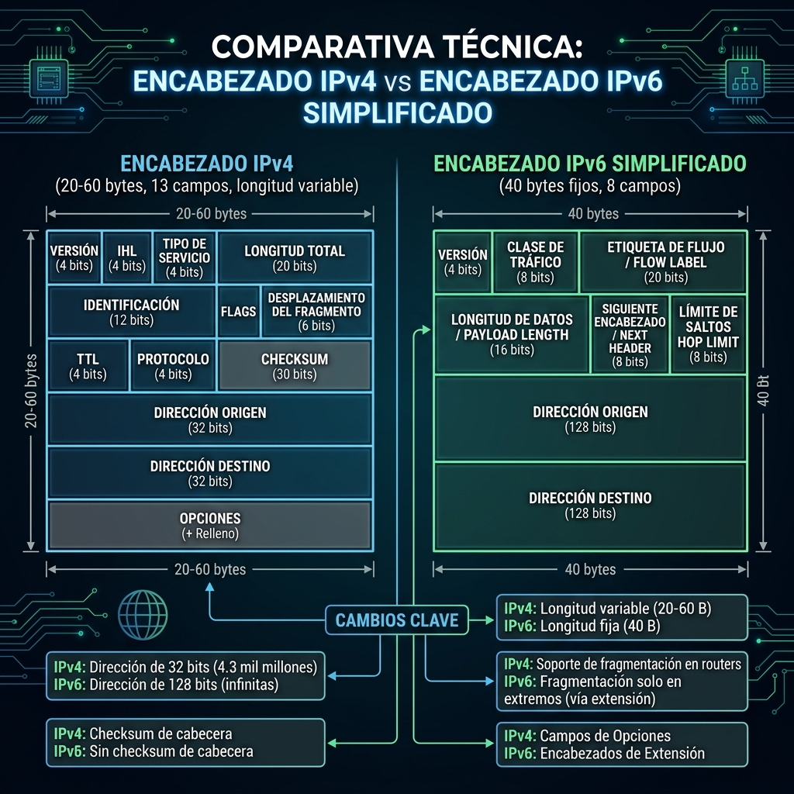

# Componentes de la Capa de Red de Comunicación

En esta lectura, profundizará en las operaciones que se llevan a cabo en la **Capa 3 del Modelo OSI (Capa de Red)**, analizando cómo se direccionan, empaquetan y enrutan los datos a través de Internet.

---

## Operaciones en la Capa de Red

La **capa de red** organiza el direccionamiento y la entrega de paquetes de datos desde el dispositivo de origen *(host)* hasta el dispositivo de destino. Este proceso implica guiar los paquetes de un router a otro a través de la infraestructura de red hasta alcanzar la dirección IP *(Internet Protocol)* del destinatario.

### Conceptos Clave de Enrutamiento:
- **Dirección IP de destino:** Contenida en la cabecera de cada paquete, le indica a los routers hacia dónde enviar la información y se registra en sus **tablas de enrutamiento**.
- **Paquete IP vs. Datagrama:**
  - **Paquete IP:** Denominación utilizada cuando se opera sobre conexiones **TCP**.
  - **Datagrama:** Denominación utilizada cuando se opera sobre conexiones **UDP**.
- **Información del Encabezado (Header):** Además del destino, incluye la dirección IP de origen, la longitud total, el tiempo de vida (TTL) y el protocolo de la capa superior.

---

## Formato de un Paquete IPv4

Un paquete IPv4 está dividido conceptualmente en dos secciones principales:

1. **Cabecera (Header):** Contiene la información de control y enrutamiento. Su tamaño oscila entre **20 y 60 bytes** (20 bytes fijos de campos obligatorios + hasta 40 bytes opcionales).
2. **Cuerpo de Datos (Payload):** Transporta la información real de la aplicación (contenido web, correo electrónico, archivos). El tamaño máximo de un paquete IPv4 completo (cabecera + datos) es de **65,535 bytes**.

---

## Los 13 Campos del Encabezado IPv4

La cabecera de un paquete IPv4 contiene **13 campos esenciales**:

| Campo | Nombre Corto | Tamaño | Descripción |
| :--- | :---: | :---: | :--- |
| **1. Versión** | `VER` | 4 bits | Indica la versión del protocolo IP utilizada (ej. IPv4 = `4`). |
| **2. Longitud del Encabezado** | `HLEN` / `IHL` | 4 bits | Indica dónde termina la cabecera y dónde empiezan los datos reales. |
| **3. Tipo de Servicio** | `ToS` / `DSCP` | 8 bits | Permite a los routers priorizar el tráfico para mantener la Calidad de Servicio (QoS). |
| **4. Longitud Total** | `Total Length` | 16 bits | Muestra el tamaño completo del paquete (cabecera + datos) en bytes (máx. 65,535 B). |
| **5. Identificación** | `ID` | 16 bits | Identificador único para reensamblar paquetes que han sido fragmentados en tránsito. |
| **6. Banderas** | `Flags` | 3 bits | Indican si el paquete ha sido fragmentado y si hay más fragmentos en camino. |
| **7. Desplazamiento de Fragmento** | `Fragment Offset` | 13 bits | Indica la posición exacta del fragmento dentro del paquete original. |
| **8. Tiempo de Vida** | `TTL` | 8 bits | Contador que disminuye en 1 con cada router que atraviesa. Si llega a 0, el paquete se descarta y se envía un mensaje de error ICMP `Time Exceeded`. |
| **9. Protocolo** | `Protocol` | 8 bits | Especifica qué protocolo de la capa superior gestiona los datos (ej. TCP = `6`, UDP = `17`, ICMP = `1`). |
| **10. Suma de Comprobación** | `Header Checksum` | 16 bits | Código de verificación de errores para detectar corrupción en la cabecera durante el tránsito. |
| **11. IP de Origen** | `Source IP` | 32 bits (4 B) | Dirección IPv4 del emisor del paquete. |
| **12. IP de Destino** | `Destination IP` | 32 bits (4 B) | Dirección IPv4 del receptor del paquete. |
| **13. Opciones** | `Options` | 0 - 40 B | Campo opcional utilizado para pruebas de diagnóstico, seguridad o enrutamiento específico. |

---

## Diferencias entre IPv4 e IPv6

El crecimiento masivo de dispositivos conectados a Internet provocó el **agotamiento de direcciones IPv4**, lo que impulsó el desarrollo de **IPv6**.

### Tabla Comparativa IPv4 vs. IPv6

| Característica | IPv4 | IPv6 |
| :--- | :--- | :--- |
| **Longitud de Dirección** | 32 bits (4 bytes) | 128 bits (16 bytes) |
| **Espacio de Direcciones** | ~4,300 millones ($4.3 \times 10^9$) | ~340 undecillones ($3.4 \times 10^{38}$) |
| **Formato de Dirección** | Decimal punteado (ej. `198.51.100.0`) | Hexadecimal separado por dos puntos (ej. `2002:0db8::ff21:0023:1234`) |
| **Abreviación de ceros** | No permitida | Permite compresión con `::` |
| **Tamaño de Cabecera** | Variable (20 a 60 bytes) | Fijo (40 bytes) |
| **Simplificación de Cabecera** | Incluye `IHL`, `ID`, `Flags`, `Checksum` | Elimina campos innecesarios e introduce **Etiqueta de Flujo** *(Flow Label)* |
| **Seguridad y Eficiencia** | Colisiones de direcciones privadas comunes | Enrutamiento más eficiente, soporte nativo para IPsec y sin colisiones de IP privada |

> **Nota sobre sintaxis IPv6:** Los bloques consecutivos de ceros se pueden comprimir usando `::`. 
> Ejemplo completo: `2002:0db8:0000:0000:0000:ff21:0023:1234` $\rightarrow$ Comprimido: `2002:0db8::ff21:0023:1234`.

---

## Relevancia para la Ciberseguridad

Para un analista de seguridad, inspeccionar los campos de un paquete IP permite:

- **Identificar el origen real o suplantado (IP Spoofing):** Comparar la IP de origen con los registros de red.
- **Analizar anomalías en TTL:** Valores inusuales de TTL pueden indicar ataques de amplificación o técnicas de evasión de IDS/IPS.
- **Verificar protocolos no autorizados:** Detectar tráfico malicioso inspeccionando el campo `Protocol`.
- **Detectar fragmentación maliciosa:** Evitar ataques de evasión por solapamiento de fragmentos (*Teardrop attack*).

---

## Puntos Clave

1. **Función de la Capa 3:** Direccionar paquetes entre distintas redes utilizando routers e IP.
2. **Estructura IPv4:** Cabecera de 20-60 bytes con 13 campos clave y carga de datos de hasta 65,535 bytes.
3. **Evolución a IPv6:** Direcciones de 128 bits que resuelven el agotamiento de IPv4 con un encabezado simplificado de 40 bytes fijos.
