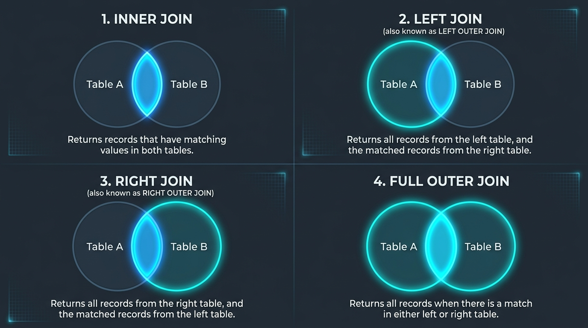

# Comparación de Tipos de Uniones (JOIN) en SQL

En esta lectura del **Curso 4: Herramientas del oficio (Linux y SQL)**, se exploran las distintas formas de correlacionar y unir información de múltiples tablas mediante **`INNER JOIN`**, **`LEFT JOIN`**, **`RIGHT JOIN`** y **`FULL OUTER JOIN`**, analizando su sintaxis, comportamiento en conjuntos de datos y aplicaciones clave en auditorías de ciberseguridad.

---

## 1. Concepto Fundamental de las Uniones (*JOINs*)

Una unión (*JOIN*) combina columnas de dos o más tablas basándose en una columna común compartida (como un identificador de dispositivo `device_id` o ID de usuario `employee_id`).

```
           ┌─────────────────────┐               ┌─────────────────────┐
           │   TABLA IZQUIERDA   │               │    TABLA DERECHA    │
           │      (FROM)         │ ────────────► │       (JOIN)        │
           │    ej. employees    │               │    ej. machines     │
           └─────────────────────┘               └─────────────────────┘
```

* **Tabla Izquierda (*Left Table*):** La tabla declarada inmediatamente después de la cláusula `FROM`.
* **Tabla Derecha (*Right Table*):** La tabla declarada inmediatamente después de la cláusula `JOIN`.
* **Cláusula `ON`:** Define la condición de correspondencia o clave de cruce (`ON tabla_izq.columna = tabla_der.columna`).
* **Calificación de Columnas (`tabla.columna`):** Si una columna comparte el mismo nombre en ambas tablas, es obligatorio anteponer el nombre de la tabla con un punto (`.`) para evitar ambigüedades (ej. `employees.device_id`).

---

## 2. Los 4 Tipos de Uniones en SQL (Diagramas de Venn)



---

## 3. Análisis Detallado por Tipo de Unión

### A. `INNER JOIN` (Unión Interna)

Devuelve **únicamente las filas que tienen una coincidencia exacta** en ambas tablas en la columna especificada. Si un registro no tiene correspondencia en la otra tabla, se omite.

```sql
SELECT username, operating_system, employees.device_id
FROM employees
INNER JOIN machines ON employees.device_id = machines.device_id;
```

> [!NOTE]
> * Si se utiliza `SELECT *`, se devolverán todas las columnas de ambas tablas. Las columnas comunes aparecerán dos veces en la salida.
> * **En Ciberseguridad:** `INNER JOIN` sirve para auditar usuarios activos que tienen actualmente asignado un equipo reconocido en la red.

---

### B. `LEFT JOIN` (Unión Externa Izquierda)

Devuelve **todos los registros de la tabla izquierda** (`FROM`), y únicamente las filas coincidentes de la tabla derecha. Si una fila de la izquierda no tiene coincidencia en la derecha, los campos de la tabla derecha se rellenan con valores `NULL`.

```sql
SELECT *
FROM employees
LEFT JOIN machines ON employees.device_id = machines.device_id;
```

> [!TIP]
> **Detección de Brechas:** Un `LEFT JOIN` permite a un analista identificar **empleados sin dispositivo asignado** (aquellos donde `machines.device_id IS NULL`), lo que podría indicar cuentas huérfanas o errores de aprovisionamiento.

---

### C. `RIGHT JOIN` (Unión Externa Derecha)

Devuelve **todos los registros de la tabla derecha** (`JOIN`), y únicamente las filas coincidentes de la tabla izquierda (`FROM`). Si un registro de la derecha no tiene correspondencia a la izquierda, los datos de la izquierda se mostrarán como `NULL`.

```sql
SELECT *
FROM employees
RIGHT JOIN machines ON employees.device_id = machines.device_id;
```

> [!IMPORTANT]
> **Equivalencia de Orden:** `A LEFT JOIN B` es equivalente a `B RIGHT JOIN A`. Al invertir el orden de las tablas en `FROM` y `JOIN`, se produce exactamente el mismo resultado.

---

### D. `FULL OUTER JOIN` (Unión Externa Completa)

Devuelve **todas las filas de ambas tablas**, emparejando las filas que coinciden e insertando valores `NULL` en los campos donde no exista coincidencia en uno u otro lado.

```sql
SELECT *
FROM employees
FULL OUTER JOIN machines ON employees.device_id = machines.device_id;
```

* Ofrece una visión global y unificada de dos inventarios.
* Al igual que en `INNER JOIN`, alterar el orden de las tablas en `FROM` y `JOIN` no cambia el conjunto total de filas devueltas.

---

## 4. Matriz Comparativa Resumen

| Tipo de Unión                | Filas de Tabla Izquierda | Filas de Tabla Derecha |          Filas No Coincidentes          | Caso de Uso en Ciberseguridad                                 |
| :---------------------------- | :----------------------: | :--------------------: | :-------------------------------------: | :------------------------------------------------------------ |
| **`INNER JOIN`**      |    Solo coincidentes    |   Solo coincidentes   |           **Excluidas**           | Identificar usuarios con dispositivos asignados activos.      |
| **`LEFT JOIN`**       |     **Todas**     |   Solo coincidentes   | Conserva izquierda (`NULL` a la der.) | Identificar usuarios sin dispositivos asignados.              |
| **`RIGHT JOIN`**      |    Solo coincidentes    |    **Todas**    |  Conserva derecha (`NULL` a la izq.)  | Identificar dispositivos no asignados / máquinas huérfanas. |
| **`FULL OUTER JOIN`** |     **Todas**     |    **Todas**    |      Conserva ambas (con`NULL`)      | Inventario forense completo de activos y cuentas.             |

---

## Puntos Clave

> [!IMPORTANT]
> * **Propósito de los JOINs:** Permiten correlacionar información dispersa entre múltiples tablas estructuradas a través de una columna común con la cláusula `ON`.
> * **`INNER JOIN`:** Restringe la salida estrictamente a la intersección de datos coincidentes.
> * **Uniones Externas (`LEFT`, `RIGHT`, `FULL`):** Preservan registros que carecen de correspondencia en una o ambas tablas, permitiendo a los analistas detectar anomalías, discrepancias y recursos huérfanos.
